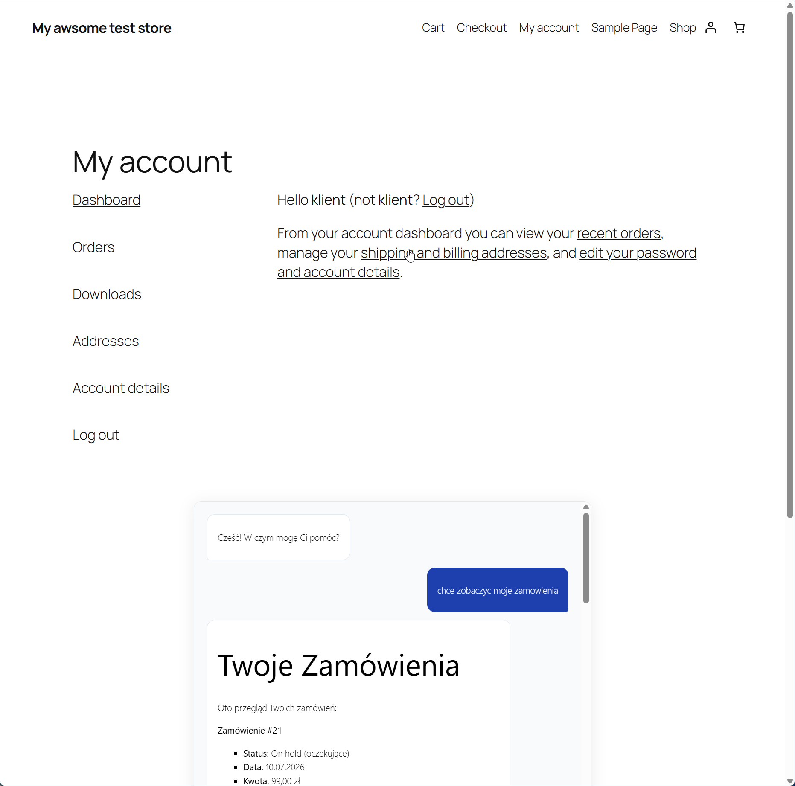
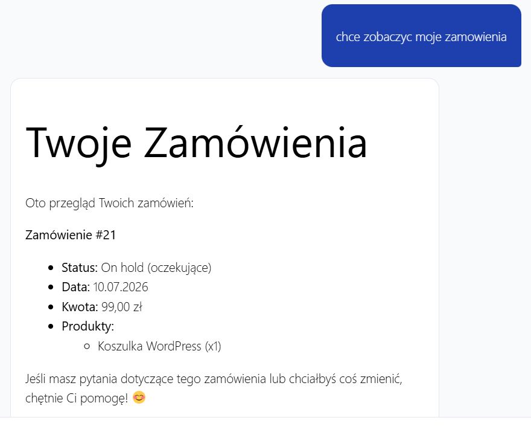
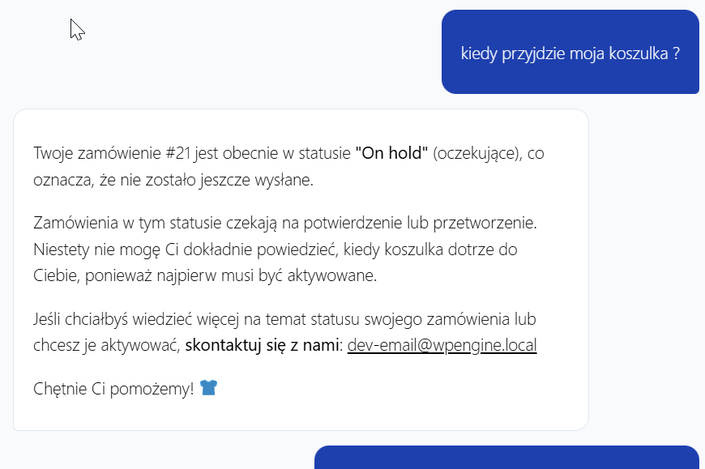
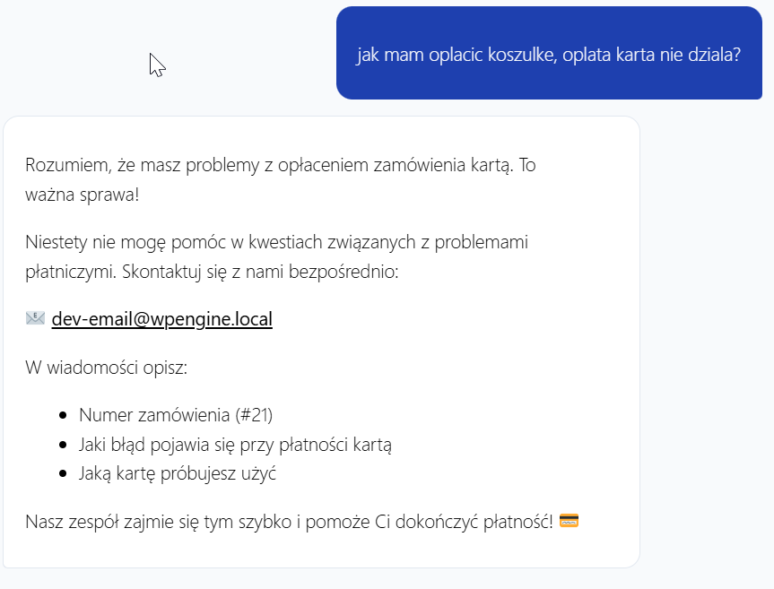

# AI WooCommerce Agent Wtyczka WordPress
 
Inteligentny agent AI obsługi klienta dla sklepów WooCommerce, oparty na Claude API (Anthropic). Klient pyta o swoje zamówienia w naturalnym języku, a agent odpowiada na podstawie rzeczywistych danych ze sklepu. Gdy agent nie może pomóc, automatycznie powiadamia administratora.
 
---
 
## Screenshot
 




---
 
## Jak to działa
 
```
Zalogowany klient pisze: "Kiedy dostanę moje zamówienie?"
    ↓
Agent pobiera zamówienia klienta z WooCommerce
    ↓
Claude analizuje pytanie i dane zamówienia
    ↓
Agent odpowiada konkretnie o zamówieniu klienta
    ↓
Jeśli nie może pomóc → email do admina (eskalacja)
```
 
---
 
## Funkcje
 
- 💬 **Chat w naturalnym języku**, klient pyta po polsku
- 📦 **Dostęp do zamówień**, agent zna historię zamówień zalogowanego klienta
- 🧠 **Pamięć rozmowy**, agent pamięta kontekst całej sesji (nie pyta "Cześć" przy każdej odpowiedzi)
- 🚨 **Eskalacja do admina**, gdy agent nie może pomóc, wysyła email do administratora
- 🔒 **Tylko zalogowani**, niezalogowany klient widzi link do strony logowania
- 🧹 **Czyszczenie sesji**, historia rozmowy kasowana automatycznie po wylogowaniu
- 📝 **Markdown**, odpowiedzi są czytelnie sformatowane (listy, pogrubienia, nagłówki)
- 🛡️ **DOMPurify**, sanitizacja HTML przed renderowaniem (ochrona przed XSS)
---
 
## Wymagania
 
- WordPress 6.0+
- PHP 8.0+
- WooCommerce 8.0+
- Klucz API Anthropic (console.anthropic.com)
- Klient musi być zalogowany
---
 
## Instalacja
 
**1. Pobierz wtyczkę**
```bash
git clone https://github.com/Pawel-Szymczyk/ai-woo-agent.git
```
 
**2. Wgraj do WordPress**
 
Skopiuj folder `ai-woo-agent` do:
```
wp-content/plugins/ai-woo-agent/
```
 
**3. Aktywuj w panelu admina**
 
WordPress Admin → Wtyczki → AI WooCommerce Agent → **Aktywuj**
 
**4. Wpisz klucz API**
 
WordPress Admin → Ustawienia → AI Assistant → wpisz klucz z [console.anthropic.com](https://console.anthropic.com)
 
**5. Włącz rejestrację klientów w WooCommerce**
 
WordPress Admin → WooCommerce → Ustawienia → Konta:
```
✅ Zezwól klientom na tworzenie konta na stronie „Moje konto"
✅ Zezwól klientom na tworzenie konta podczas realizacji zamówienia
```
 
---
 
## Osadzanie na stronie
 
Dodaj shortcode na stronie **Moje konto** lub dowolnej innej:
 
```
[ai_woo_agent]
```
 
Niezalogowany użytkownik zobaczy link do logowania zamiast chatu.
 
---
 
## Przykładowe pytania klienta
 
```
"Pokaż moje zamówienia"
"Kiedy dostanę zamówienie #21?"
"Jaki jest status mojej paczki?"
"Chcę złożyć reklamację"
"Jak mogę zwrócić produkt?"
"Co zamówiłem ostatnio?"
```
 
---
 
## Struktura plików
 
```
ai-woo-agent/
├── ai-woo-agent.php                 # Główny plik wtyczki
├── includes/
│   ├── class-ai-api.php             # Komunikacja z Claude API
│   └── class-ai-woo-agent.php      # Logika agenta WooCommerce
└── assets/
    ├── js/
    │   ├── chat.js                  # Frontend — interfejs chatu
    └── css/
        └── chat.css                 # Style widgetu
```
 
---
 
## Eskalacja do administratora
 
Gdy agent nie może odpowiedzieć na pytanie klienta, automatycznie wysyła email do administratora sklepu:
 
```
Temat: [AI Agent] Klient potrzebuje pomocy
 
Klient: jan.kowalski@example.com
 
Pytanie: Chcę zmienić adres dostawy zamówienia #21
 
Odpowiedź agenta: Nie mogę pomóc w tej sprawie.
Skontaktuj się z nami: admin@sklep.pl
```
 
Triggery eskalacji (konfigurowalne w kodzie):
- "nie mogę pomóc"
- "skontaktuj się"
- "nie mam informacji"
---
 
## Bezpieczeństwo
 
- Endpoint REST wymaga zalogowanego użytkownika (`is_user_logged_in()`)
- Agent widzi TYLKO zamówienia aktualnie zalogowanego klienta
- Sanitizacja danych wejściowych (`sanitize_text_field`)
- Renderowanie Markdown przez DOMPurify (ochrona przed XSS)
- Klucz API przechowywany w bazie WordPress — nigdy w kodzie
- Nonce WordPress na każdym żądaniu REST
- Historia sesji kasowana przy wylogowaniu
---
 
## Dostosowanie
 
### Zmiana liczby wyświetlanych zamówień
 
W `class-ai-woo-agent.php` w metodzie `get_customer_context()`:
```php
$orders = wc_get_orders( [
    'customer' => $user_id,
    'limit'    => 5, // ← zmień na więcej jeśli potrzeba
    ...
] );
```
 
### Zmiana triggerów eskalacji
 
W metodzie `maybe_escalate()`:
```php
$triggers = [
    'nie mogę pomóc',
    'skontaktuj się',
    'nie mam informacji',
    'proszę zadzwonić', // ← dodaj własne triggery
];
```
 
### Dostosowanie wyglądu
 
Edytuj `assets/css/chat.css` zmień kolor na brand klienta:
```css
/* Zmień #1E40AF na kolor marki klienta */
.ai-message--user  { background: #1E40AF; }
#ai-chat-send      { background: #1E40AF; }
#ai-chat-input:focus { border-color: #1E40AF; }
```
 
### Dodanie własnych instrukcji do agenta
 
W metodzie `get_system_prompt()` dodaj instrukcje specyficzne dla sklepu:
```php
return $context . "\n\n" .
    "Jesteś asystentem sklepu {$shop_name}. " .
    'Godziny obsługi klienta: pon-pt 9-17. ' .    // ← dodaj własne
    'Zwroty możliwe w ciągu 30 dni od zakupu. ' . // ← informacje
    ...
```
 
---
 
## Statusy zamówień WooCommerce
 
| Status | Znaczenie |
|---|---|
| `pending` | Oczekuje na płatność |
| `processing` | Płatność przyjęta, w realizacji |
| `on-hold` | Wstrzymane, czeka na potwierdzenie |
| `completed` | Zakończone, wysłane |
| `cancelled` | Anulowane |
| `refunded` | Zwrócone |
| `failed` | Płatność nieudana |
 
---
 
## Koszty API
 
| Model | Koszt | Zalecenie |
|---|---|---|
| Claude Haiku | ~$0.25/1M tokenów | Demo, mały ruch |
| Claude Sonnet | ~$3/1M tokenów | Produkcja, lepsza jakość |
 
Typowa rozmowa (~5 wiadomości) = ok. 2000 tokenów = $0.0005 przy Haiku.
 
---
 
## Licencja
 
GPL v2 or later, zgodnie ze standardem WordPress.
 
---
 
## Autor
 
**Paweł Szymczyk** — [github.com/Pawel-Szymczyk](https://github.com/Pawel-Szymczyk)
 
Freelancer specjalizujący się w integracji AI z WordPress i WooCommerce.
Zainteresowany podobnym rozwiązaniem dla swojego sklepu? Napisz: [kontakt]